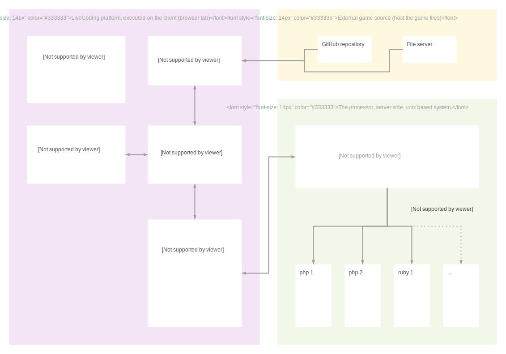

# About LiveCoding

LiveCoding is a platform to learn how to code in different languages via small games.

## Three key elements of the platform

* **The client web app**, provides the editor for coding and the game execution environnment.
* **The processor**, hosted on a server, he manage process to execute user code in corresponding language.
* **Games**, are developed in ES6 JavaScript, and hosted in their dedicated repo, the user can select the game he wnats to load in the client app.

## Architecture main elements

