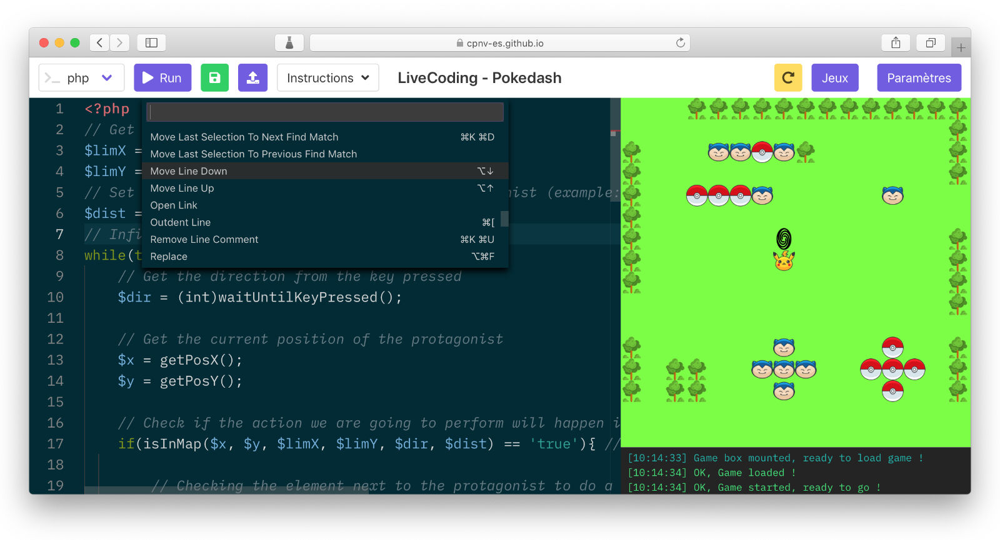

# Client code editor

The embeded code editor is provided by the [monaco editor](https://github.com/Microsoft/monaco-editor) package. A web based code editor, developped by Microsoft for Visual Studio Code.

## Why monaco

- Due to the popularity of VS code, the package is actively maintained.
- Great documentation and API specs.
- Support many languages syntax.
- Uses modern JS, with ES6 features.
- Edition features (move lines, multi caret, find & replace...)

In the screenshot you can see the editor's action menu which lists all possible actions.

## EditorBox component

The [EditorBox](../../client/src/components/editor/EditorBox.vue) component manages the editor. When the component is mounted in the view, the component will spawn a new editor and load the configuration and themes into it. When the editor is mounted, we register a new function for the `onDidChangeModelContent` event. This event is fired when the content of the editor is updated, and allows to get the editor content and store it in the application state.

## Editor settings

In the app settings modal, you can change the editor theme and the editor font size.
