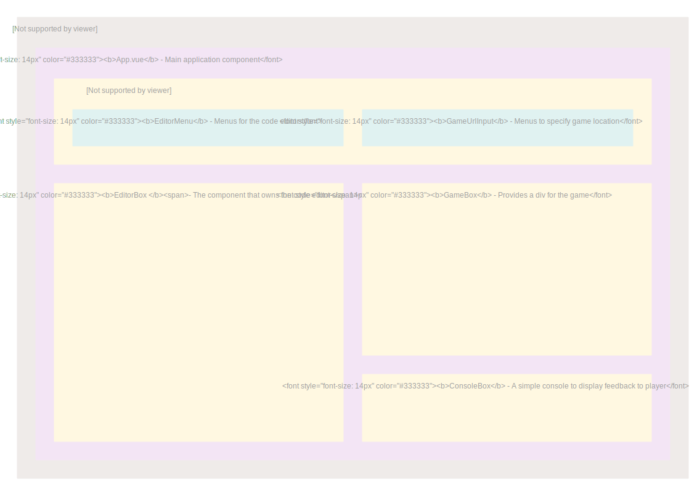

# Client app structure

The client app is a simple web application.
We use the [Vue.js](https://vuejs.org/) framework to manage the view.
However the main features and the logic are implemented using pure ES6 JavaScript, totally decoupled from Vue.js
So Vue.js is mainly used to simplify the reactive updates of the dom and organize the code into separate components, we only use the elementary functions of the framework.

## Components of the app

## Vue store

To easyly share the datas between each comonents we use [vuex](https://vuex.vuejs.org/) the official Vue.js way to manage state in a web pall.

All the properties of the application are grouped into the store, which can be easily injected into the components that need it.
