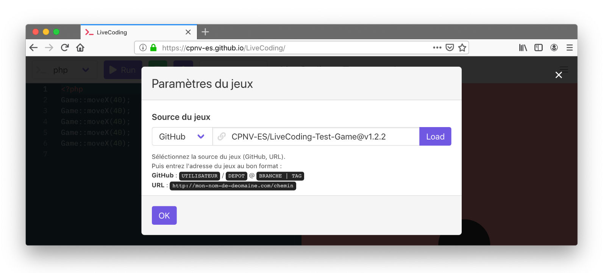

# Create your own game

Games are and must be developed independently of the LiveCoding platform.
We recomend developping game using the starter game and following this documentation.
**This guide explain the base concepts for creating a game**

## Providers

Actually LiveCoding can load games from two sources :
* **GitHub repo** needs the `username/repo` string.
* **Web server** needs the URL of the server.

To use your game in the app, you need to specify it's url in the *game* popup menu.

## Game folder structure

You can organize your game structure as you want, but you need to corectly declare your files in the game manifest ! **The game manifst must be a the root of your game folder**, this file is loaded first by the platform, and specifies all the infos four your game, see the [game manifest specs](./game_manifest_specs.md) for details.

## Required files

To create a functional set, you need at least 3 files :

* **manifest.json**, The main file that will gather all the important information of the game.
* A `.js` fils that contains the game logic, you must specify the `.js` path in the manifest.
* Minimum one commands file to translate `php` or `ruby` user code to game interactions, see [game commands execution docs](./game_commands_execution.md) to understand structure and possibilities of commands.

## Javascript Game engines

To create more sophisticated games, you can use javascript game engines. For example, the [Pokedash](https://github.com/CPNV-ES/LiveCoding-Pokedash-Game) game uses [p5.js](https://p5js.org/), and the [Block](https://github.com/bastiennicoud/LiveCoding-Block-Game) game uses [PIXI.js](http://www.pixijs.com/).
Most of this game engines needs to be loaded in the main page, and not in a js module (under the hood, the games are lodaed in a javascript module via the new `import()` method). To load js libraries globally, you must use the libraries key in the manifest [see details here](./game_manifest_specs.md#data->-libraries).