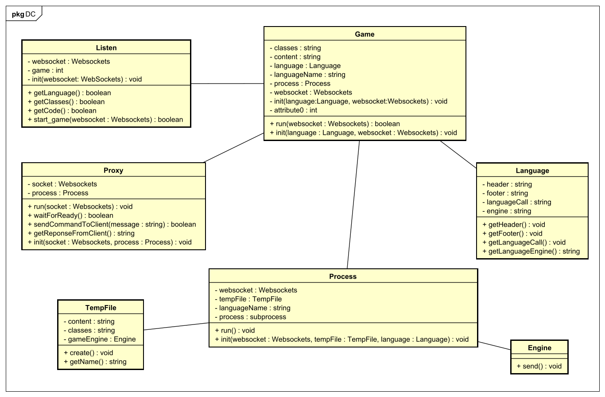

# LiveCoding Server Structure

The basic role of the server is to execute the game code provided by the client. The execution is done in real time. This means that the server provides a communication channel betwween the client and the server. This is provide using a server proxy and a subprocess.

## Server Procedure
The server use a websocket to communicate with the client. This is provide by the websockets module. The websockets module allow the server to open many connection in the same time to listen all client messages.

When the client run a new game a new connection is established and the server create a new listen class (for the current client) to read all client data. The listen class is the first step in the server-client connection procedure. Listen class read all needed client data:

- the game classes
- the game engine
- the game code to execute

When all needed elements are sended by the client, the listen class create a new game. The class game use all client data stored into to listen class to create a new temporary file with all code to execute, a new process and a new proxy server. After, when all is ready game run the server Proxy and the process to start the iteration with the client and the process.
 
## Server Architecture

### WebSokets
The websockets architecture is define at [Websockets module](https://websockets.readthedocs.io/en/stable/intro.html)

### Class Diagram

