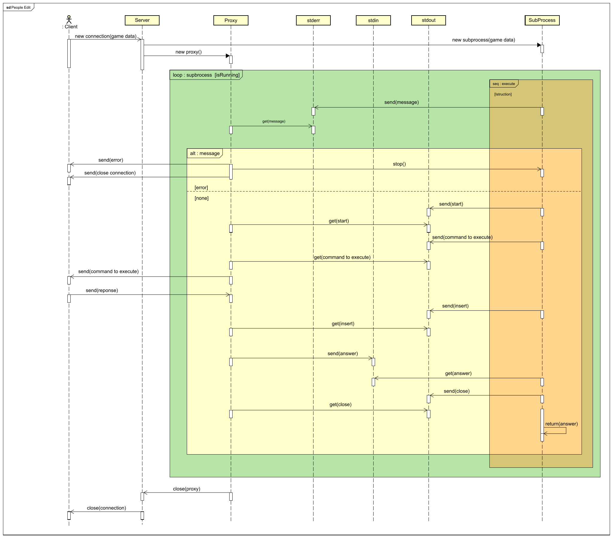

# The server proxy and the subprocess

## Intro
LiveCoding allow you to write instructions in a selected language an execute them in live mode. To do this all client instructions are executed by the server into a subprocess using the engine and foreach istruction a reponse is sended to cliet.
The communication between the process and the client is done through a proxy server.

## What is a process module in Python

Process module allow you to execute anythings in baground mode and allow you to iterate with the running process with three channels: stdin, stdout and stderr.
The running process is usually called subprocess. 
For the LiveCoding project the subprocess is used to launch all client instructions in their selected language.
For example if the client code is written in ruby then the server start a new subprocess in which are executed all client instruction. For example: 
	
	subprocess.Popen("ruby fileWithCommands" shell=True, stdout=subprocess.PIPE, stdin=subprocess.PIPE, stderr=subprocess.PIPE)

## Execute the client code
As you can see the subprocess are used to perform client game. But how the subprocess comunicate with the client? A serverProxy is used transfer informations between client and subporcess.

## Protocol ServerProxy-Process
The communication between the server and the subprocess is managed by a simple communication protocol that allows to:
	
- synchronize the server-process communication
- send data to the process
- read data from the process

There are three communication channels between the server and the process

- Stdin
- Sdterr
- Stdout

The stderr channel is used to communicate errors, while the stdin channel is used to receive server information the stdout to send them.

Protocol code strings and sequency are:

- none
- start
- insert
- close 

All of theme allow the synchronisation between server proxy and the process.

The **none** string code inform the server proxy that the istruction to execute are be opened and there is no problems.

The **start** string inform the server proxy that the is ready to send a new data to stdout

The **insert** string inform the server proxy that data are been sended and now process is waiting a server confirmation to proceed.

The **close** string inform the server proxy that confirmation has been received and the current istruction is closed with succes.

##Protocol ServerProxy-Client

The server proxy send the command to run to client using a json format whenever a command is available in the stdout chanel. The json format contains the game command to execute client side and the corresponding value.

	{"comandToExecute":"param"}

When the command is send proxyServer wait for a confirmation that are after sended to the process using the stdin channel

## Complete sequence

